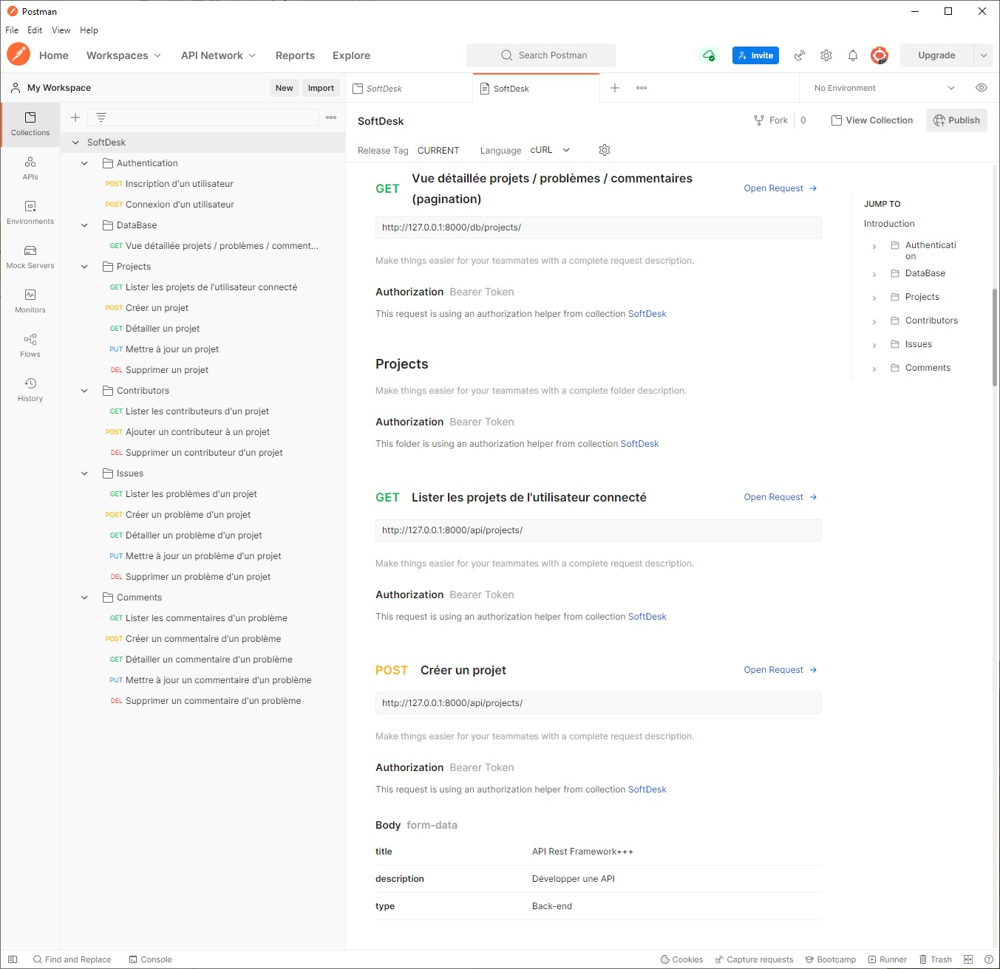
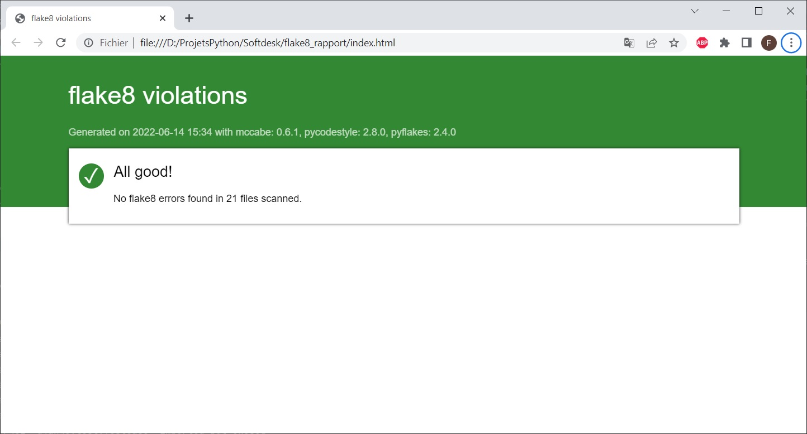

[](https://docs.python.org/fr/3.10/)
[](https://docs.djangoproject.com/fr/4.0/)
[](https://pyjwt.readthedocs.io/en/2.4.0/installation.html)

# SoftDesk

## Table des matières
1. [Informations générales](#Informations_générales)
2. [Technologies](#technologies)
3. [Installation](#installation)
4. [Exécution](#Exécution)
5. [Vue générale des API](#Screenshot)
6. [Conformité du code aux directives PEP 8](#Conformité_PEP_8)

## Informations_générales
***
Application de suivi des problèmes pour les trois plateformes (site web, applications Android et iOS).

Elle permet aux utilisateurs de créer divers projets, d'ajouter des utilisateurs à des projets 
spécifiques, de créer des problèmes au sein des projets et d'attribuer des libellés à ces problèmes en fonction de 
leurs priorités, de balises, etc.

Les trois applications exploiteront les points de terminaison d'API qui serviront les données.

## Technologies
***
Technologies ou packages majeurs utilisés dans ce projet :
* [windows 10 Famille](https://docs.microsoft.com/fr-fr/windows/whats-new/whats-new-windows-10-version-21h2) : version 21H2 
* [python](https://docs.python.org/fr/3.10/) : version 3.10.0
* [django](https://docs.djangoproject.com/fr/4.0/) : version 4.0.3
* [django REST framework](https://www.django-rest-framework.org/) : version 3.13.1
* [JWT](https://pyjwt.readthedocs.io/en/2.4.0/installation.html) : version 2.4.0

## Installation
***
Réaliser l'installation sous Windows avec le terminal PowerShell 

Le clonage (git clone) se fait dans le répertoire LITReview. Vous installez ensuite les dépendances du projet après 
avoir généré et activé l'environnement virtuel.
```
$ git clone https://github.com/FredericTNT/Softdesk
$ cd Softdesk
$ python -m venv venv
$ venv/Scripts/activate
(venv)$ pip install -r requirements.txt
```
Dernière étape avant la première exécution, vous générez la base de données avec le programme de migration automatique
en vous plaçant dans le répertoire softdesk.
```
(venv)$ cd softdesk
(venv)$ python manage.py migrate
```

## Exécution
***
Rendez-vous à la racine du répertoire softdesk. Le serveur d'application se lance en exécutant le programme manage.py
dans l'environnement virtuel activé.

```
(venv)$ cd softdesk
(venv)$ python manage.py runserver
```

La base SQLite de l'application (db.sqlite3) et le programme manage.py se situent dans le répertoire
Softdesk\softdesk

Lorsque le serveur fonctionne, l'application est accessible via un navigateur web à 
l'url suivante : http://localhost:8000/

## Screenshot
***
API - Collection Postman



## Conformité_PEP_8
***
La vérification de conformité du code aux directives PEP 8 peut s'effectuer en exécutant le programme flake8.exe 
à partir du répertoire courant Softdesk avec les paramètres suivants et l'installation préalable des deux modules 
flake8 et flake8-html dans l'environnement virtuel activé :
```
(venv)$ pip install flake8
(venv)$ pip install flake8-html

(venv)$ venv\scripts\flake8.exe --show-source --statistics --max-line-length=120 --exclude=softdesk\*\migrations --format=html --htmldir=flake8_rapport softdesk\
```
Un rapport index.html est généré dans le sous-répertoire flake8_rapport avec la liste des éventuels points de
non-conformité.



<!---
## FAQs
-->
